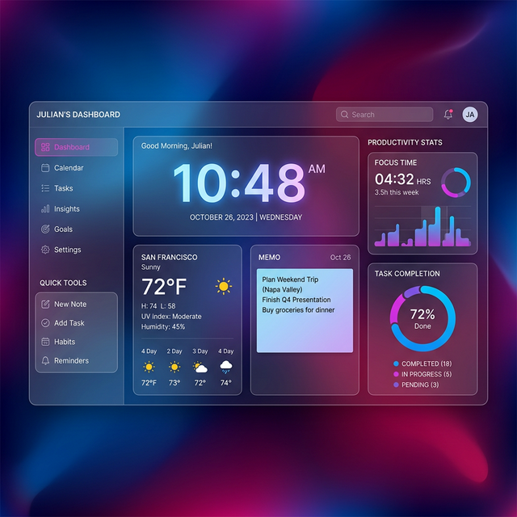

# 🌟 Super App Personal Dashboard

A stunning, drag-and-drop personal dashboard designed to combat "app fatigue". Consolidate your daily workflow into a single, beautiful glassmorphism interface.



## ✨ Features

*   **Fully Customizable Grid:** Drag and drop widgets exactly where you want them using smooth animations.
*   **Widget Library:** Snap together pre-built modules including a Digital Clock, Weather Forecast, Quick Notes, Daily Inspiration Quotes, and Productivity Stats.
*   **Premium Glassmorphism UI:** Built with sleek, frosted-glass effects overlaid on a beautiful dynamic mesh-gradient background.
*   **Local Persistence:** Automatically saves your customized layout and notes directly to your browser's local storage.
*   **Zero Complex Dependencies:** Built almost entirely with plain HTML, Vanilla CSS, and Vanilla JavaScript (powered by SortableJS via CDN). No build steps or messy package managers required.

## 🚀 Getting Started

Getting started is as simple as opening a file. There are no build steps, Node modules, or development servers required.

1.  **Clone the repository:**
    ```bash
    git clone https://github.com/YOUR_USERNAME/super-app-dashboard.git
    cd super-app-dashboard
    ```
2.  **Open the Application:**
    Simply open the `index.html` file in your preferred modern web browser (Chrome, Firefox, Safari, Edge).
    *   *Mac:* `open index.html`
    *   *Windows:* `start index.html`

## 🛠️ Built With

*   **HTML5 & CSS3:** Semantic markup and modern CSS features including CSS Grid, Flexbox, Custom Properties, and Backdrop Filters.
*   **Vanilla JavaScript:** Lightweight DOM manipulation and logic.
*   **[SortableJS](https://sortablejs.github.io/Sortable/):** Used for the robust, smooth drag-and-drop functionality between the widget library and the dashboard grid.

## 🎨 Design Philosophy

This project was built to address the 2026 consumer need for "Consolidated Digital Experiences". Instead of switching between 5 different tabs for your clock, notes, calendar, and weather, this dashboard brings them all into one customizable, aesthetically pleasing space that helps you maintain focus.

## 📄 License

This project is licensed under the MIT License - see the LICENSE file for details.
